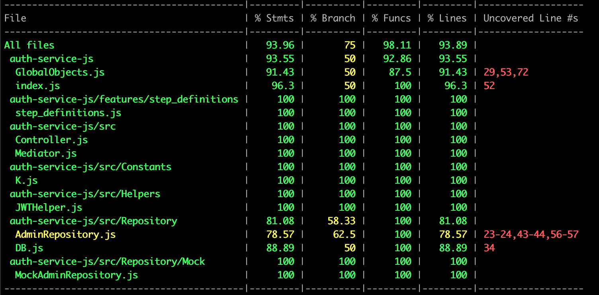

# Docs

## Coverage

### Coverage before refactoring

| File                                      | % Stmts | % Branch | % Funcs | % Lines | Uncovered Line #s |
| ----------------------------------------- | ------- | -------- | ------- | ------- | ----------------- |
| All files                                 | 93.96   | 75       | 98.11   | 93.89   |                   |
| auth-service-js                           | 93.55   | 50       | 92.86   | 93.55   |                   |
| GlobalObjects.js                          | 91.43   | 50       | 87.5    | 91.43   | 29,53,72          |
| index.js                                  | 96.3    | 50       | 100     | 96.3    | 52                |
| auth-service-js/features/step_definitions | 100     | 100      | 100     | 100     |                   |
| step_definitions.js                       | 100     | 100      | 100     | 100     |                   |
| auth-service-js/src                       | 100     | 100      | 100     | 100     |                   |
| Controller.js                             | 100     | 100      | 100     | 100     |                   |
| Mediator.js                               | 100     | 100      | 100     | 100     |                   |
| auth-service-js/src/Constants             | 100     | 100      | 100     | 100     |                   |
| K.js                                      | 100     | 100      | 100     | 100     |                   |
| auth-service-js/src/Helpers               | 100     | 100      | 100     | 100     |                   |
| JWTHelper.js                              | 100     | 100      | 100     | 100     |                   |
| auth-service-js/src/Repository            | 81.08   | 58.33    | 100     | 81.08   |                   |
| AdminRepository.js                        | 78.57   | 62.5     | 100     | 78.57   | 23-24,43-44,56-57 |
| DB.js                                     | 88.89   | 50       | 100     | 88.89   | 34                |
| auth-service-js/src/Repository/Mock       | 100     | 100      | 100     | 100     |                   |
| MockAdminRepository.js                    | 100     | 100      | 100     | 100     |                   |
